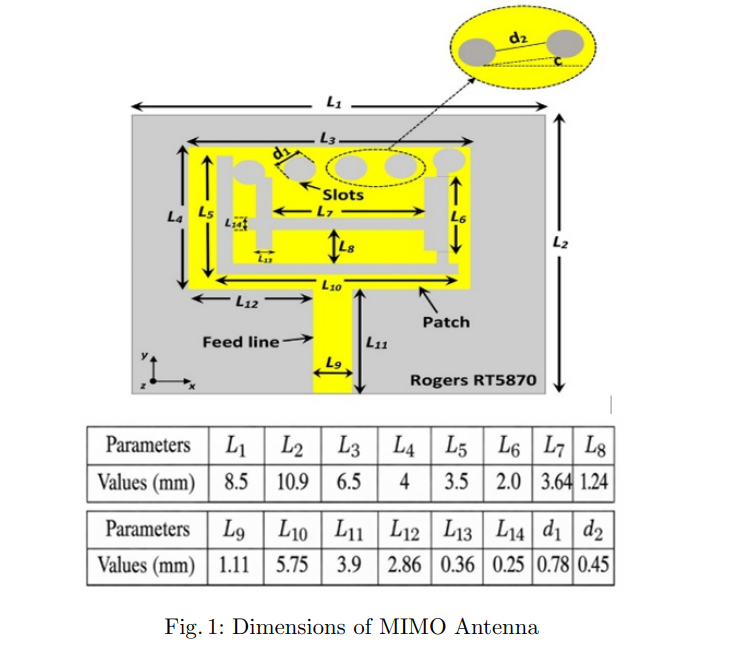
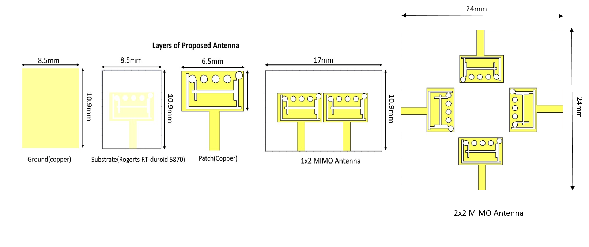
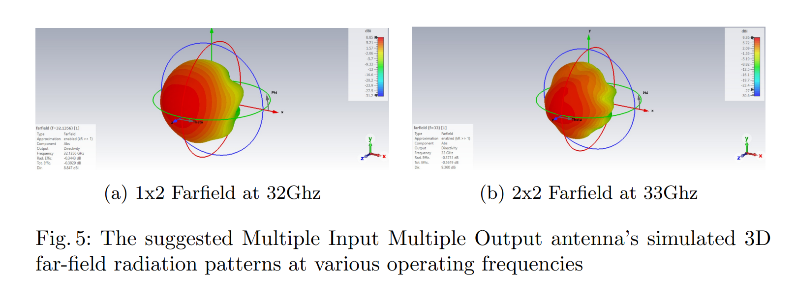

# Design of a Compact Wideband Self-Isolated MIMO Antenna for 5G mm-Wave Applications

## Overview

Designed a compact self-isolated MIMO antenna for 5G millimeter-wave communication systems using slot-engineering techniques.

## Key Features

- Wideband operation for 5G mm-wave communication
- Slot-engineered radiator design
- High isolation between antenna elements
- Low Envelope Correlation Coefficient (ECC)
- Improved impedance bandwidth

## Tools Used

- CST Studio Suite
- Rogers RT/Duroid 5870

## Project Highlights

- Designed single-element antenna
- Developed 1×2 MIMO configuration
- Developed 2×2 MIMO configuration
- Evaluated Gain, Isolation, ECC and TARC

## Research Contribution

- Presented at Research Conclave
- Research manuscript submitted for publication

## Documentation

- Project Report: MIMO_Antenna_Project_Report.pdf

- Research Paper: MIMO_Antenna_Research_Paper.pdf

## Antenna Design

## Proposed Configurations

## Radiation Patterns

